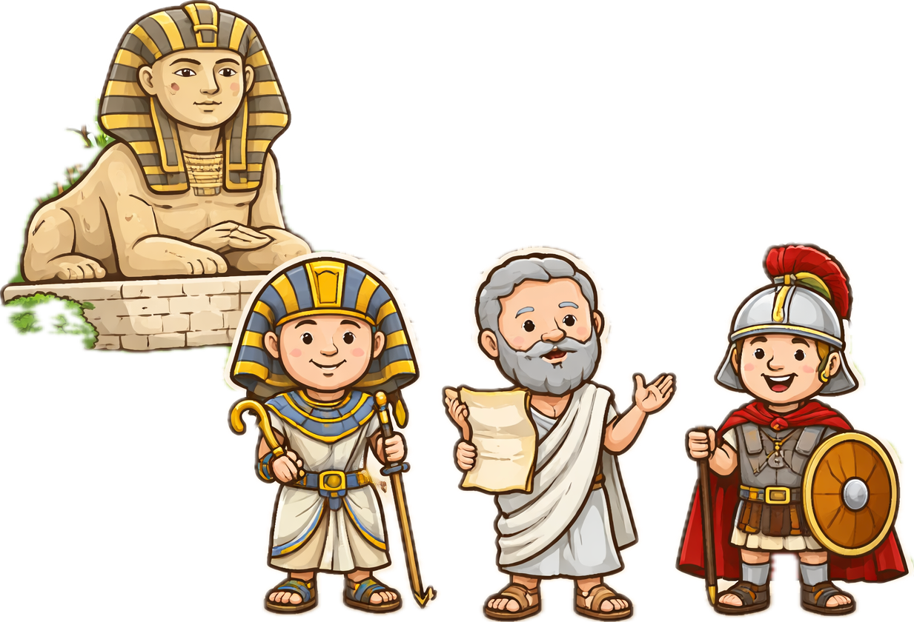

# memory deck
@title: 중등 기초 영어 단어
@subject: 영어
@category: vocabulary
@tags: 영어,단어,중등,기초
@priority: 8
@interval: 3

| 단어 | 의미 | 도해 |
| --- | --- | --- |
| achieve | 이루다 |  |
| ancient | 고대의 |  |
| borrow | 빌리다 | |
| compare | 비교하다 | |
| decide | 결정하다 | |
| effect | 효과 | |
| include | 포함하다 | |
| improve | 향상시키다 | |
| prevent | 막다 | |
| respond | 응답하다 | |
